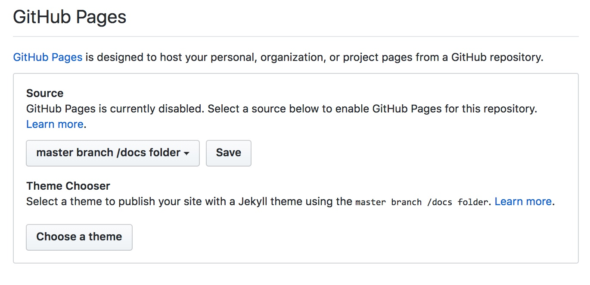

## Set up a github repository

Create a new github repository for your writing based on this template.  You could create an empty repository and copy in these files, or you could fork this repository.

In the settings for your repository, find the section for configuring github pages, and choose the option to "enable GitHub Pages for this repository" to use **master branch/docs folder**.  It should look like this:

