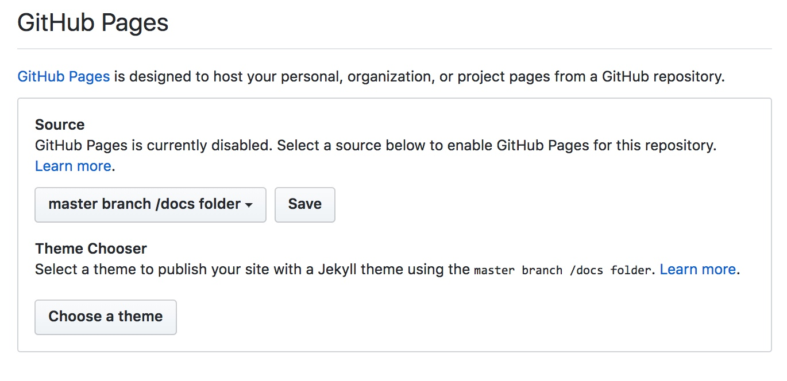

Create a new github repository for your writing based on this template.  (You could create an empty repository and copy in these files, or you could fork this repository.)

Set gh to serve from your `docs` directory.

